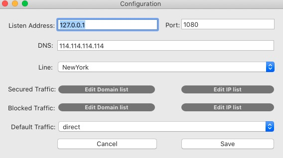

# HyperGate

Dedicated to providing a fast, stable and secured networking proxy(socks5).

This is the HyperGate MacOS client, avaliable for MacOS 10.10 and later.

HyperGate take a strong encryption of your outgoing packets. And provides a lot  of traffic lines all over the world to speed up your network access. 

## What's the difference between ShadowSocks?

First, HyperGate take different encryption method with shadowsocks, and it is hard to track. HyperGate is easy to setup, do not need any additional cost, just download the client, run it, enter a license key, that's all. You can go any where you want, with or without secured lines. 

## Quick Guide

The configuration of hypergate is strainghtforward, run the client ,open cofiguration window, click the secured domain or ip list button, enter the site domain or ip address, save configuration, then restart service(stop, start) to take effect.

second, change your network proxy type to socks, enter the address and port of hypergate client listening(default is 127.0.0.1:1080), done.

## Support & Contact

Submit an issue when you have any problems, or send mail to admin at hypergate.io, license key can only be acquired through mail.
